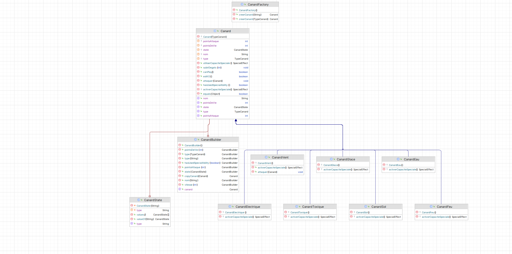

# Canard Fighter Simulator
## Contributeur
Mellagui meryem \
Medard guillaume 

## Introduction

Bienvenue dans le projet **Canard Fighter Simulator** ! Ce projet est un simulateur de combat mettant en scène des "Canards Légendaires" disposant de types, forces, faiblesses, attaques et capacités spéciales. Il sert de base pour appliquer et approfondir les connaissances en conception orientée objet, en particulier l'héritage, le polymorphisme et la liaison dynamique en Java.

## Questions partie 4

# Canard Fighter Simulator - README
## Questions de modélisation

### 1. **Quelles classes pourraient être abstraites ?**
La classe **`Canard`** pourrait être abstraite. Elle définit des comportements communs à tous les canards, mais certains aspects, comme les capacités spéciales, sont différents d'un type de canard à un autre. La méthode `activerCapaciteSpeciale()` est donc abstraite.

### 2. **Quels comportements communs pourraient être définis dans une interface ?**
Une interface pourrait être utilisée pour définir des comportements comme **`CapaciteSpeciale`**, permettant à chaque type de canard de définir sa propre capacité spéciale. Cela permet une modularité et une extensibilité du code.

### 3. **Comment représenter un changement de statut (par exemple, brûlé ou paralysé) dans la modélisation ?**
Un changement de statut est représenté par un attribut `Statut` dans la classe `Canard`. L'effet du statut modifie le comportement d'un canard, par exemple, un canard "Gelé" ne peut pas attaquer pendant un tour.

```java
public enum Statut {
    NORMAL, BRULE, GUELE, PARALYSE
}
```

### 4. **Quels seraient les avantages d’utiliser une classe ou une interface supplémentaire pour gérer les capacités spéciales ?**
Utiliser une interface ou une classe dédiée pour gérer les capacités spéciales permet de rendre le code plus modulaire et extensible. Chaque capacité spéciale serait gérée indépendamment des autres aspects du jeu, ce qui simplifie les modifications futures. Par exemple, si un nouveau type de canard est ajouté, sa capacité spéciale peut être gérée facilement via l'interface `CapaciteSpeciale`.

### 5. **Quels défis sont associés à l’extensibilité de votre modèle pour ajouter de nouveaux types de canards ou de nouvelles capacités ?**
L'extension du modèle peut être compliquée si les classes sont trop rigides. Pour ajouter un nouveau type de canard, il faut modifier l'énumération `TypeCanard`, ainsi que la classe `Canard` et ses classes filles. Pour ajouter une nouvelle capacité, il faut aussi créer de nouvelles classes ou interfaces. Un design plus flexible pourrait utiliser des **design patterns** comme le **Factory Pattern** ou le **Strategy Pattern** pour faciliter l'ajout de nouveaux types ou capacités.

## Table des Matières

1. [Description du Projet](#description-du-projet)
2. [Fonctionnalités](#fonctionnalités)
3. [Diagramme UML](#diagramme-uml)
4. [Choix Techniques](#choix-techniques)
5. [Installation et Utilisation](#installation-et-utilisation)
6. [Réalisations Bonus](#réalisations-bonus)
7. [Tests Unitaires](#tests-unitaires)
8. [Contributeurs](#contributeurs)

## Description du Projet

Le **Canard Fighter Simulator** est un jeu de combat où chaque canard possède des caractéristiques uniques telles que des points de vie, des points d'attaque, un type (Eau, Feu, Glace, Vent, etc.), et des capacités spéciales. Les canards peuvent s'affronter dans des combats tour par tour, où les dégâts infligés dépendent des types et des capacités spéciales utilisées.

## Fonctionnalités

- **Création de Canards** : Permet à l'utilisateur de créer des canards avec des caractéristiques personnalisées.
- **Combats Tour par Tour** : Simule des combats entre deux canards avec des règles de force/faiblesse basées sur les types.
- **Capacités Spéciales** : Chaque type de canard dispose d'une capacité spéciale unique.
- **Effets de Statut** : Ajout d'effets persistants comme "brûlé", "gelé", ou "paralysé".
- **Points d'Énergie (PE)** : Limitation de l'utilisation des attaques à l'aide d'une ressource PE.
- **Attaques Critiques** : Probabilité d'attaques critiques infligeant 2x les dégâts.

## Diagramme UML




## Choix Techniques

- **Héritage et Polymorphisme** : Utilisation de classes de base et de classes filles pour représenter les différents types de canards. Cela permet de partager du code commun tout en permettant des comportements spécifiques pour chaque type.
- **Implementation d'un builder**, et d'une factory pour simplifier au maximum la création des canards, et facilité l'ajout de futur capacité.
- **Implementation d'une interface** La gestion des capacité spéciales et faites par l'intermédiaire d'interface totalement redéfinissable, l'avantage étant que l'on peut encore plus facilement subsituer le comportement par défaut des fonction en retournant de nouveaux objets avec de nouvelles capacité. 
- **Enum pour les Types** : Utilisation d'un enum `TypeCanard` pour gérer les types et les relations de force/faiblesse. Cela simplifie la gestion des interactions entre les types.
- **Capacités Spéciales** : Implémentation de capacités spéciales dans chaque classe fille pour diversifier les stratégies de combat.
- **Modularité** : Le code est organisé en classes séparées pour faciliter la maintenance et l'extension du projet.


